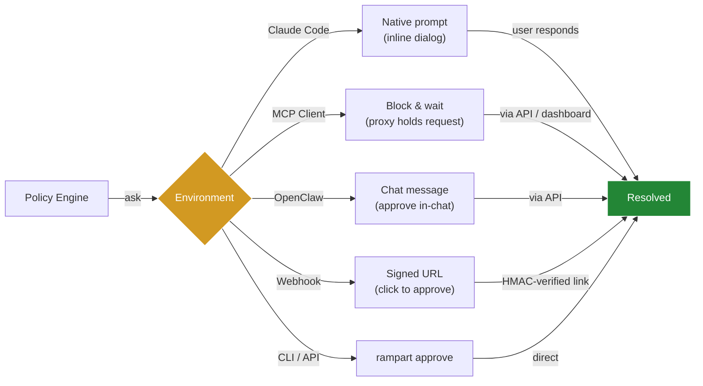

# Approval Flow

For commands in the grey area — not dangerous enough to block outright, but risky enough that a human should decide — Rampart provides a flexible approval flow that works across different environments.

## When to Use Approvals

Use `action: ask` when a command is sensitive but context matters:

- Production deployments that are legitimate but need oversight
- Destructive-but-sometimes-needed operations (`rm -rf build/`, database resets)
- Package installations from external sources
- Commands that modify critical configuration files
- Outbound network calls in trusted projects

For commands that should **never** run (credential access, exfiltration), use `action: deny` instead.

## Policy Configuration

<Steps>

### Define Approval Rules

Add `action: ask` rules to your policy file:

```yaml
version: "1"
default_action: allow

policies:
  - name: production-deploys
    match:
      tool: ["exec"]
    rules:
      - action: ask
        when:
          command_matches:
            - "kubectl apply *"
            - "terraform apply *"
            - "docker push *production*"
        message: "Production deployment requires approval"

  - name: approve-installs
    match:
      tool: ["exec"]
    rules:
      - action: ask
        when:
          command_matches:
            - "pip install *"
            - "npm install *"
            - "cargo install *"
        message: "Package install — approve or deny?"
```

### Optional: Enable Audit Logging

Add `audit: true` to log user decisions for compliance:

```yaml
policies:
  - name: audited-production-deploy
    rules:
      - action: ask
        ask:
          audit: true    # Log whether user approved or denied
        when:
          command_matches:
            - "kubectl apply *"
        message: "Deploy to cluster?"
```

### Optional: CI/Headless Mode

Use `headless_only: true` to automatically deny in CI environments:

```yaml
policies:
  - name: production-safety
    rules:
      - action: ask
        ask:
          audit: true
          headless_only: true  # Deny in CI, prompt interactively
        when:
          command_matches:
            - "*--env=production*"
        message: "Production operation requires approval"
```

</Steps>

## How Approvals Reach You

The approval flow adapts to your environment:



### Claude Code — Native Inline Prompt

When a matching command is intercepted, Claude Code displays:

```
Hook PreToolUse:Bash requires confirmation for this command:
Rampart: Production deployment requires approval

Do you want to proceed?
> 1. Yes
  2. No

Esc to cancel · Tab to amend · ctrl+e to explain
```

The user stays in their session. No switching terminals or opening dashboards.

<Note>
`action: ask` triggers the native approval prompt even when Claude Code runs with `--dangerously-skip-permissions`.
</Note>

### MCP Clients — Dashboard or API

For MCP-based agents, the proxy holds the request until resolved:

```bash
rampart pending
# ID       Tool  Command                 Age
# abc123   exec  kubectl apply -f prod   2m ago

rampart approve abc123
# ✓ Approved — command will execute
```

Or approve via the web dashboard at `http://localhost:9090/dashboard/`.

### OpenClaw — In-Chat Approval

OpenClaw receives a chat message with the approval request. Respond in the chat to approve or deny.

### Webhook Notifications

If you've configured webhook notifications, you'll receive a message with HMAC-signed approve/deny links:

```json
{
  "timestamp": "2026-03-03T14:23:10Z",
  "decision": "ask",
  "tool": "exec",
  "command": "kubectl apply -f prod.yaml",
  "policy": "production-deploys",
  "message": "Production deployment requires approval",
  "agent": "claude-code",
  "session": "myapp/main",
  "approval_id": "abc123",
  "approve_url": "https://yourserver/approve?id=abc123&sig=...",
  "deny_url": "https://yourserver/deny?id=abc123&sig=..."
}
```

Click the link to approve or deny without touching the terminal.

## Managing Pending Approvals

### List Pending Requests

```bash
rampart pending
```

Output:

```
ID       Tool  Command                        Agent        Age
abc123   exec  kubectl apply -f prod.yaml     claude-code  2m ago
def456   exec  pip install requests           claude-code  5m ago
```

### Approve a Request

```bash
rampart approve abc123
```

The command executes immediately.

### Deny a Request

```bash
rampart deny abc123
```

The command is blocked with an error message returned to the agent.

## Approval Timeout

Pending approvals expire after **1 hour** by default. Configure with `--approval-timeout`:

```bash
rampart serve --approval-timeout 2h
```

Expired approvals are automatically denied.

## Audit Trail

When `audit: true` is set, the audit log includes the user's decision:

```bash
rampart audit tail --follow
```

Sample output:

```json
{
  "timestamp": "2026-03-03T14:23:15Z",
  "id": "abc123",
  "tool": "exec",
  "agent": "claude-code",
  "session": "myapp/main",
  "request": {
    "command": "kubectl apply -f prod.yaml"
  },
  "decision": {
    "action": "ask",
    "resolved": "approved",
    "resolved_by": "user@localhost",
    "matched_policies": ["production-deploys"],
    "message": "Production deployment requires approval"
  },
  "prev_hash": "sha256:..."
}
```

This creates an immutable record of who approved what and when.

## Differences: `ask` vs `require_approval`

| | `action: ask` | `action: require_approval` |
|---|---|---|
| UI | Inline in Claude Code session | Rampart dashboard / CLI |
| Requires `rampart serve` | No | Yes |
| User stays in session | Yes | No (must switch terminal) |
| Best for | Interactive development | Automated agents / CI |
| Audit logging | Optional (`audit: true`) | Always enabled |

<Note>
`action: require_approval` is now an alias for `action: ask` with `audit: true`. New policies should prefer the explicit `action: ask` syntax.
</Note>

## Testing Your Policy

Test approval rules before deploying:

```bash
# Dry-run a command
rampart test "kubectl apply -f prod.yaml"
# → Decision: ask
# → Matched: production-deploys
# → Message: Production deployment requires approval

# Lint your policy file
rampart policy lint ~/.rampart/policies/custom.yaml
```

## Example: Multi-Environment Strategy

Different approval rules for different branches:

```yaml
policies:
  - name: production-branch-deploys
    match:
      tool: ["exec"]
    rules:
      - action: ask
        ask:
          audit: true
          headless_only: true
        when:
          session_matches: ["myapp/main", "myapp/production"]
          command_matches:
            - "kubectl apply *"
            - "terraform apply *"
        message: "Production deploy on main branch requires approval"

  - name: dev-branch-deploys
    match:
      tool: ["exec"]
    rules:
      - action: allow
        when:
          session_matches: ["myapp/dev", "myapp/staging"]
          command_matches:
            - "kubectl apply *"
        message: "Dev deploy allowed"
```

Session identity is auto-detected from git as `reponame/branch`. Override with `RAMPART_SESSION=my-label`.

## Web Dashboard

When `rampart serve` is running, access the web dashboard at:

```
http://localhost:9090/dashboard/
```

The **Active** tab shows pending approvals with approve/deny buttons. No CLI needed.

## See Also

- [Live Dashboard](/features/live-dashboard) — Real-time monitoring and approval UI
- [Audit Trail](/features/audit-trail) — Hash-chained audit logging
- [Webhook Notifications](/features/webhook-notifications) — Push notifications for approvals
