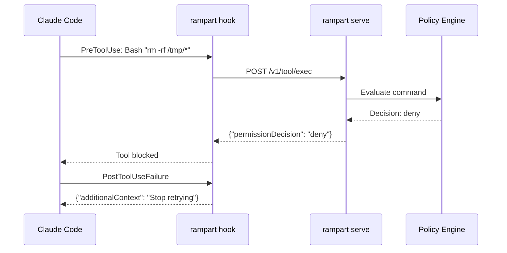

Rampart integrates natively with Claude Code through its PreToolUse and PostToolUseFailure hook system. Every tool call — Bash, Read, Write, Edit, Fetch, Task, and future tools — flows through your policy engine before execution.

## Quick Setup

<Steps>
  <Step title="Install Rampart service">
    Start the background policy server and save the authentication token:

    ```bash
    rampart serve install
    ```

    This installs a systemd (Linux) or launchd (macOS) service that:
    - Runs on port 9090 by default
    - Saves a bearer token to `~/.rampart/token`
    - Starts automatically on boot
    - Enables the web dashboard at http://localhost:9090/dashboard/
  </Step>

  <Step title="Wire Claude Code hooks">
    Install the Rampart hook into Claude Code settings:

    ```bash
    rampart setup claude-code
    ```

    This modifies `~/.claude/settings.json` to add:
    - **PreToolUse hook**: Evaluates every tool call before execution
    - **PostToolUseFailure hook**: Prevents Claude from retrying denied commands

    <Note>
      Safe to run multiple times — won't duplicate hooks or overwrite existing settings.
    </Note>
  </Step>

  <Step title="Use Claude normally">
    Launch Claude Code with dangerous mode enabled:

    ```bash
    claude --dangerously-skip-permissions
    ```

    All tool calls now route through Rampart. No wrapper needed.
  </Step>
</Steps>

## How It Works



Claude Code fires PreToolUse for every tool. Rampart returns:
- `"permissionDecision": "allow"` → Tool executes normally
- `"permissionDecision": "deny"` → Tool is blocked, reason shown to user
- `"permissionDecision": "ask"` → Claude shows native approval prompt

## What Gets Protected

The hook intercepts **all** Claude Code tools using a wildcard matcher (`"matcher": ".*"`):

<CodeGroup>
```yaml Exec Commands
tool: exec
params:
  command: "npm install lodash"
```

```yaml File Operations
tool: read
params:
  path: "~/.ssh/id_rsa"
```

```yaml Network Requests
tool: fetch
params:
  url: "https://api.example.com/data"
```

```yaml File Writes
tool: write
params:
  path: "/etc/hosts"
  content: "..."
```
</CodeGroup>

Even future tools added to Claude Code are automatically covered — the wildcard matcher ensures comprehensive protection.

## Configuration Details

The setup command installs this configuration to `~/.claude/settings.json`:

```json
{
  "hooks": {
    "PreToolUse": [
      {
        "matcher": ".*",
        "hooks": [
          {
            "type": "command",
            "command": "rampart hook"
          }
        ]
      }
    ],
    "PostToolUseFailure": [
      {
        "matcher": ".*",
        "hooks": [
          {
            "type": "command",
            "command": "rampart hook"
          }
        ]
      }
    ]
  }
}
```

<Warning>
  The hook command must be in your system PATH. If you see "command not found" errors, add rampart to PATH:

  **Linux/macOS:**
  ```bash
  export PATH="$HOME/.local/bin:$PATH"
  ```

  **Windows (PowerShell):**
  ```powershell
  $env:PATH += ";$env:USERPROFILE\.rampart\bin"
  ```
</Warning>

## Example Session

Terminal output when Claude attempts dangerous operations:

```bash
$ claude --dangerously-skip-permissions

You: Install the latest version of numpy

Claude: I'll install numpy for you.

$ pip install numpy
✅ Allowed by policy [allow-dev]

You: Delete all temporary files

Claude: I'll clean up /tmp for you.

$ rm -rf /tmp/*
🔴 Rampart: Destructive command blocked
   Reason: Matches pattern 'rm -rf *' in policy block-destructive

Claude: I apologize, but I cannot execute that command as it's blocked 
by your security policy. Would you like me to delete specific files instead?
```

## Policy Customization

Create custom rules for Claude Code workflows:

```yaml ~/.rampart/policies/custom.yaml
version: "1"
default_action: allow

policies:
  - name: claude-safe-npm
    match:
      agent: ["claude-code"]
      tool: ["exec"]
    rules:
      - action: allow
        when:
          command_matches:
            - "npm install *"
            - "npm run test"
            - "npm run build"
        message: "Safe npm commands allowed"

  - name: claude-protect-credentials
    match:
      agent: ["claude-code"]
      tool: ["read"]
    rules:
      - action: deny
        when:
          path_matches:
            - "**/.env"
            - "**/.aws/credentials"
            - "**/.ssh/id_*"
        message: "Credential file access denied"

  - name: claude-ask-before-deploy
    match:
      agent: ["claude-code"]
      tool: ["exec"]
    rules:
      - action: ask
        when:
          command_contains:
            - "kubectl apply"
            - "terraform apply"
            - "docker push"
        message: "Deployment command requires approval"
```

After editing, reload:
```bash
rampart serve --reload
```

## Monitoring

<Tabs>
  <Tab title="Live Dashboard">
    Open http://localhost:9090/dashboard/ in your browser:

    - **Active tab**: Live stream of tool calls with approve/deny buttons
    - **History tab**: Browse past tool calls, filter by decision
    - **Policy tab**: Test commands before Claude runs them

    No authentication required on localhost.
  </Tab>

  <Tab title="Terminal (TUI)">
    Watch events in a live terminal dashboard:

    ```bash
    rampart watch
    ```

    Output:
    ```
    ╔══════════════════════════════════════════════════════════════╗
    ║  RAMPART — enforce — 3 policies                             ║
    ╠══════════════════════════════════════════════════════════════╣
    ║  ✅ 14:23:03  read  ~/project/src/main.go      [default]     ║
    ║  ✅ 14:23:01  exec  "npm test"                 [allow-dev]   ║
    ║  🔴 14:23:05  exec  "rm -rf /tmp/*"            [block-dest]  ║
    ╚══════════════════════════════════════════════════════════════╝
    ```
  </Tab>

  <Tab title="Audit Logs">
    Tail the hash-chained audit trail:

    ```bash
    rampart audit tail --follow
    ```

    Verify integrity:
    ```bash
    rampart audit verify
    ```
  </Tab>
</Tabs>

## Troubleshooting

### Hook not firing

1. **Check rampart is in PATH:**
   ```bash
   which rampart
   # Should output a path, not "not found"
   ```

2. **Verify settings.json was updated:**
   ```bash
   cat ~/.claude/settings.json | grep rampart
   # Should show "rampart hook" command
   ```

3. **Check service is running:**
   ```bash
   curl http://localhost:9090/healthz
   # Should return "ok"
   ```

### Permission denied errors

If all commands are denied:

1. **Check token is accessible:**
   ```bash
   cat ~/.rampart/token
   # Should output a token starting with "rampart_"
   ```

2. **Verify policy loaded:**
   ```bash
   rampart doctor
   # Check "Policy loaded" shows your active policy
   ```

3. **Test policy directly:**
   ```bash
   echo '{"tool_name":"Bash","tool_input":{"command":"echo test"}}' | rampart hook
   # Should output {"hookSpecificOutput":{"permissionDecision":"allow"}}
   ```

## Uninstalling

Remove Rampart hooks from Claude Code:

```bash
rampart setup claude-code --remove
```

This removes the PreToolUse and PostToolUseFailure hooks while preserving other settings.

To completely remove Rampart:
```bash
rampart serve uninstall  # Stop and remove service
rm -rf ~/.rampart        # Delete config and audit logs
```

## Advanced: Session Tagging

Tag Claude sessions by project for granular audit trails:

```bash
# In your shell profile (~/.bashrc, ~/.zshrc)
export RAMPART_SESSION="myapp/main"
```

Then write session-specific policies:

```yaml
policies:
  - name: production-branch-protection
    match:
      agent: ["claude-code"]
    rules:
      - action: ask
        when:
          session_matches: ["myapp/main", "myapp/production"]
          command_contains: ["git push", "deploy"]
        message: "Production deployments require approval"
```

Audit events will be tagged with the session identifier for filtering and reporting.
