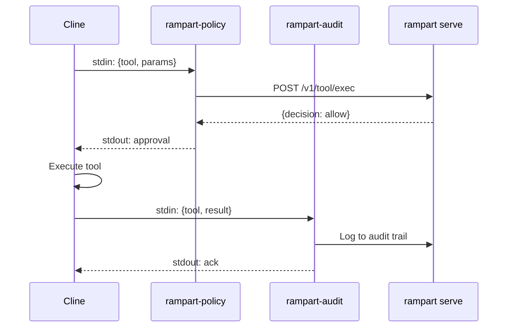

Rampart integrates with Cline (VS Code AI coding agent) through its native hook system. Hooks evaluate tool calls before execution and log completed actions for audit.

## Quick Setup

<Steps>
  <Step title="Start Rampart service">
    Install and start the background policy server:

    ```bash
    rampart serve install
    ```

    This creates a systemd/launchd service on port 9090 with a saved token at `~/.rampart/token`.
  </Step>

  <Step title="Install Cline hooks">
    Install hook scripts to Cline's global hooks directory:

    ```bash
    rampart setup cline
    ```

    This creates:
    - `~/Documents/Cline/Hooks/PreToolUse/rampart-policy` — Evaluates tool calls
    - `~/Documents/Cline/Hooks/PostToolUse/rampart-audit` — Logs completed actions

    <Note>
      For workspace-level hooks instead of global, use `--workspace` flag.
    </Note>
  </Step>

  <Step title="Use Cline normally">
    Open VS Code and use Cline as usual. All tool calls now route through Rampart — no additional configuration needed.
  </Step>
</Steps>

## Hook Locations

Rampart installs scripts to these directories:

<CodeGroup>
```bash Global Hooks (Default)
~/Documents/Cline/Hooks/PreToolUse/rampart-policy
~/Documents/Cline/Hooks/PostToolUse/rampart-audit
```

```bash Workspace Hooks (--workspace flag)
.clinerules/hooks/PreToolUse/rampart-policy
.clinerules/hooks/PostToolUse/rampart-audit
```
</CodeGroup>

Cline automatically discovers and executes hooks in these locations. Multiple hooks can coexist — Cline runs them in alphabetical order.

## How It Works



The PreToolUse hook receives tool call JSON on stdin, queries the policy server, and returns approval/denial on stdout. The PostToolUse hook logs completed actions to the audit trail.

## Hook Scripts

Rampart generates these scripts during setup:

<CodeGroup>
```bash PreToolUse Hook
#!/usr/bin/env bash
# Rampart PreToolUse hook for Cline
# Evaluates tool calls through policy engine before execution

set -euo pipefail

# Read Cline hook input from stdin and pass to rampart
# Config auto-discovered from ~/.rampart/config.yaml or rampart.yaml
exec "/path/to/rampart" hook --format cline
```

```bash PostToolUse Hook
#!/usr/bin/env bash
# Rampart PostToolUse hook for Cline
# Logs completed tool calls for audit trail

set -euo pipefail

# Read Cline hook input from stdin and log to audit
# Config auto-discovered from ~/.rampart/config.yaml or rampart.yaml
exec "/path/to/rampart" hook --format cline --mode audit 2>/dev/null || true
```
</CodeGroup>

The scripts use absolute paths to the `rampart` binary, so they work regardless of Cline's PATH configuration.

## Example Session

Terminal output when Cline attempts operations:

```bash
$ code .  # Open VS Code with Cline extension

> Cline: I'll install the dependencies

✅ exec: "npm install"
   Policy: allow-dev
   Agent: cline

> Cline: Let me check your AWS credentials

🔴 read: "~/.aws/credentials"
   Policy: block-credential-reads
   Reason: Credential access blocked

> Cline: I cannot access that file due to security policies. 
> Would you like me to proceed differently?
```

## Policy Configuration

Create Cline-specific policies:

```yaml ~/.rampart/policies/custom.yaml
version: "1"
default_action: allow

policies:
  - name: cline-safe-dev
    match:
      agent: ["cline"]
      tool: ["exec"]
    rules:
      - action: allow
        when:
          command_matches:
            - "npm *"
            - "yarn *"
            - "git status"
            - "git diff"
        message: "Safe development commands"

  - name: cline-protect-env
    match:
      agent: ["cline"]
      tool: ["read", "write"]
    rules:
      - action: deny
        when:
          path_matches:
            - "**/.env"
            - "**/.env.*"
            - "**/secrets.yaml"
        message: "Environment files blocked"

  - name: cline-ask-git-push
    match:
      agent: ["cline"]
      tool: ["exec"]
    rules:
      - action: ask
        when:
          command_contains: ["git push"]
        message: "Git push requires approval"
```

Reload policies:
```bash
rampart serve --reload
```

## Workspace vs Global Hooks

<Tabs>
  <Tab title="Global Hooks">
    **Location:** `~/Documents/Cline/Hooks/`

    **Use when:**
    - You want consistent protection across all projects
    - You're the only user on the machine
    - Policies are user-specific, not project-specific

    **Install:**
    ```bash
    rampart setup cline
    ```
  </Tab>

  <Tab title="Workspace Hooks">
    **Location:** `.clinerules/hooks/` (project root)

    **Use when:**
    - Different projects need different policies
    - You want team-wide enforcement (commit hooks to git)
    - Project has specific security requirements

    **Install:**
    ```bash
    rampart setup cline --workspace
    ```

    **Commit to git:**
    ```bash
    git add .clinerules/hooks/
    git commit -m "Add Rampart hooks for team"
    ```
  </Tab>
</Tabs>

## Monitoring

### Live Dashboard

View Cline's tool calls in real time:

```bash
# Browser dashboard
open http://localhost:9090/dashboard/

# Terminal UI
rampart watch
```

### Audit Trail

The PostToolUse hook logs all completed actions:

```bash
# Tail audit logs
rampart audit tail --follow

# Search for Cline actions
rampart audit search --agent cline --decision deny

# Statistics
rampart audit stats
```

Output:
```
Agent: cline
  Total calls: 1,247
  Allowed: 1,201
  Denied: 12
  Logged: 34
```

## Troubleshooting

### Hooks not executing

1. **Verify hook scripts exist:**
   ```bash
   ls -la ~/Documents/Cline/Hooks/PreToolUse/
   # Should show rampart-policy with executable permissions
   ```

2. **Check script permissions:**
   ```bash
   chmod +x ~/Documents/Cline/Hooks/PreToolUse/rampart-policy
   chmod +x ~/Documents/Cline/Hooks/PostToolUse/rampart-audit
   ```

3. **Test hook directly:**
   ```bash
   echo '{"tool":"exec","params":{"command":"echo test"}}' | \
     ~/Documents/Cline/Hooks/PreToolUse/rampart-policy
   # Should output approval JSON
   ```

### Service connection errors

1. **Check service is running:**
   ```bash
   curl http://localhost:9090/healthz
   # Should return "ok"
   ```

2. **Restart service:**
   ```bash
   # systemd (Linux)
   systemctl --user restart rampart-proxy

   # launchd (macOS)
   launchctl unload ~/Library/LaunchAgents/com.rampart.proxy.plist
   launchctl load ~/Library/LaunchAgents/com.rampart.proxy.plist
   ```

3. **Check logs:**
   ```bash
   # systemd
   journalctl --user -u rampart-proxy -f

   # launchd
   tail -f ~/.rampart/rampart-proxy.log
   ```

### Hooks blocking everything

If all commands are denied:

1. **Check policy file:**
   ```bash
   rampart doctor
   # Look for "Policy loaded" and "default_action"
   ```

2. **Test policy:**
   ```bash
   rampart test "npm install"
   # Should show whether command would be allowed
   ```

3. **Reset to defaults:**
   ```bash
   rampart init --defaults
   rampart serve --reload
   ```

## Uninstalling

Remove Rampart hooks from Cline:

```bash
# Global hooks
rampart setup cline --remove

# Workspace hooks
rampart setup cline --workspace --remove
```

This removes hook scripts but preserves policies and audit logs.

Complete removal:
```bash
rampart serve uninstall
rm -rf ~/.rampart
```

## Advanced: Multi-Hook Configuration

Cline supports multiple hooks in each directory. Combine Rampart with other tools:

```bash
~/Documents/Cline/Hooks/PreToolUse/
├── 00-rampart-policy      # Runs first (security)
├── 10-cost-tracker        # Runs second (budget)
└── 20-custom-validator    # Runs third (business logic)
```

Hooks run in alphabetical order. Use numeric prefixes to control execution sequence.

## Session Tagging

Tag Cline sessions by workspace:

```bash
# VS Code workspace settings (.vscode/settings.json)
{
  "terminal.integrated.env.linux": {
    "RAMPART_SESSION": "myproject/dev"
  },
  "terminal.integrated.env.osx": {
    "RAMPART_SESSION": "myproject/dev"
  }
}
```

Audit events will be tagged with the session identifier for filtering.
