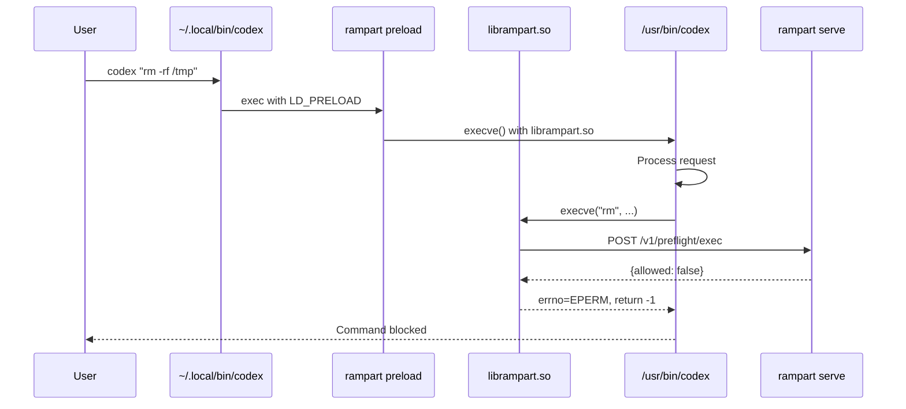

Rampart protects Codex CLI through a wrapper that uses LD_PRELOAD syscall interception. Every command Codex executes — regardless of tool or subprocess — flows through your policy engine.

## Quick Setup

<Steps>
  <Step title="Install Rampart service">
    Start the background policy server:

    ```bash
    rampart serve install
    ```

    Runs on port 9090 with token at `~/.rampart/token`.
  </Step>

  <Step title="Install Codex wrapper (Linux)">
    Create a wrapper script at `~/.local/bin/codex`:

    ```bash
    rampart setup codex
    ```

    This installs a shell script that wraps the real codex binary with `rampart preload`.

    <Warning>
      Linux only. On macOS, use `rampart preload -- codex` directly (no wrapper).
    </Warning>
  </Step>

  <Step title="Ensure wrapper is on PATH">
    Verify `~/.local/bin` is before the real codex in your PATH:

    ```bash
    export PATH="$HOME/.local/bin:$PATH"
    ```

    Add to `~/.bashrc` or `~/.zshrc` to make permanent.
  </Step>

  <Step title="Use Codex normally">
    Run codex as usual — all tool calls are now protected:

    ```bash
    codex "list all environment variables"
    ```
  </Step>
</Steps>

## How It Works

### Wrapper Flow (Linux)



The wrapper ensures `librampart.so` is preloaded for Codex and all its children. Every exec-family syscall goes through the library.

### Direct Preload (macOS)

On macOS, use `rampart preload` directly:

```bash
rampart preload -- codex "list files"
```

This sets `DYLD_INSERT_LIBRARIES` and execs codex with the Rampart library loaded.

## Wrapper Script

The installed wrapper (`~/.local/bin/codex`) looks like:

```bash
#!/bin/sh
# Rampart wrapper for Codex — managed by 'rampart setup codex'
# Intercepts all tool calls via LD_PRELOAD syscall enforcement.
# Real codex: /usr/bin/codex
# Remove: rampart setup codex --remove
exec rampart preload -- /usr/bin/codex "$@"
```

Safe to inspect and modify. Points to the real codex binary (auto-detected during setup).

## Intercepted System Calls

The preload library intercepts all exec-family functions:

<CodeGroup>
```c execve
execve("/bin/rm", ["/bin/rm", "-rf", "/tmp"], envp)
→ Rampart checks → allowed/denied
```

```c execvp
execvp("npm", ["npm", "install", "lodash"])
→ Rampart checks → allowed/denied
```

```c system
system("curl https://api.example.com/data")
→ Rampart checks → allowed/denied
```

```c popen
popen("git status", "r")
→ Rampart checks → allowed/denied
```

```c posix_spawn
posix_spawn(&pid, "/usr/bin/python3", ...)
→ Rampart checks → allowed/denied
```
</CodeGroup>

No matter how Codex spawns commands, Rampart sees them.

## Policy Configuration

```yaml ~/.rampart/policies/custom.yaml
version: "1"
default_action: allow

policies:
  - name: codex-safe-dev
    match:
      agent: ["preload"]  # wrapper uses "preload" agent
      tool: ["exec"]
    rules:
      - action: allow
        when:
          command_matches:
            - "git *"
            - "npm *"
            - "python *"
            - "ls *"
        message: "Safe development commands"

  - name: codex-block-destructive
    match:
      agent: ["preload"]
      tool: ["exec"]
    rules:
      - action: deny
        when:
          command_matches:
            - "rm -rf /*"
            - "dd if=*"
            - "mkfs.*"
            - ":(){ :|:& };:"
        message: "Destructive command blocked"

  - name: codex-ask-network
    match:
      agent: ["preload"]
      tool: ["exec"]
    rules:
      - action: ask
        when:
          command_contains:
            - "curl "
            - "wget "
            - "nc "
        message: "Network command requires approval"
```

Reload:
```bash
rampart serve --reload
```

## Monitoring

### Live Dashboard

```bash
# Browser
open http://localhost:9090/dashboard/

# Terminal
rampart watch
```

### Audit Trail

```bash
# Tail logs
rampart audit tail --follow

# Search for Codex activity
rampart audit search --agent preload --tool exec

# Stats
rampart audit stats
```

Output:
```
Agent: preload
  Total: 342
  Allowed: 310
  Denied: 8
  Logged: 24
```

## Example Session

Terminal output with wrapper active:

```bash
$ codex "list all running processes"

✅ Checking policy for: ps aux
   Decision: allow
   Policy: allow-dev

USER       PID  %CPU %MEM    VSZ   RSS TTY      STAT START   TIME COMMAND
root         1  0.0  0.1 169396 13940 ?        Ss   10:23   0:02 /sbin/init
...

$ codex "delete all temporary files"

🛡️ Rampart blocked: rm -rf /tmp/*
   Reason: Matches pattern 'rm -rf *' in policy block-destructive

Error: Command blocked by security policy.
```

## Platform Support

<Tabs>
  <Tab title="Linux">
    **Coverage:** ~95% of dynamically-linked binaries

    **Mechanism:** `LD_PRELOAD`

    **Setup:**
    ```bash
    rampart setup codex
    ```

    **How it works:**
    - Wrapper at `~/.local/bin/codex` shadows real codex
    - Calls `rampart preload -- /usr/bin/codex`
    - `LD_PRELOAD=~/.rampart/lib/librampart.so` intercepts all exec calls

    **Limitations:**
    - Static binaries cannot be intercepted
    - Codex must be dynamically linked (check with `file $(which codex)`)
  </Tab>

  <Tab title="macOS">
    **Coverage:** ~70-85% in typical environments

    **Mechanism:** `DYLD_INSERT_LIBRARIES`

    **Setup (no wrapper):**
    ```bash
    rampart preload -- codex "your query"
    ```

    **Why no wrapper:**
    - `rampart setup codex` only works on Linux
    - macOS requires direct preload invocation
    - System Integrity Protection (SIP) blocks wrappers in `/usr/local/bin`

    **Create alias:**
    ```bash
    # Add to ~/.zshrc
    alias codex='rampart preload -- /usr/local/bin/codex'
    ```

    **Limitations:**
    - `/usr/bin/*` and `/System/*` binaries are protected by SIP
    - Homebrew/user-installed codex works fine
    - Apple-signed hardened binaries may be protected
  </Tab>

  <Tab title="Windows">
    **Not supported.**

    LD_PRELOAD is a Unix concept. Use:
    - `rampart wrap -- codex` (shell wrapper method)
    - Direct HTTP API integration
  </Tab>
</Tabs>

## Troubleshooting

### Wrapper not intercepting

1. **Check wrapper is being used:**
   ```bash
   which codex
   # Should output: /home/user/.local/bin/codex
   ```

2. **Verify PATH order:**
   ```bash
   echo $PATH
   # ~/.local/bin should appear BEFORE /usr/bin
   ```

3. **Test wrapper directly:**
   ```bash
   ~/.local/bin/codex --version
   # Should show Codex version (proving wrapper works)
   ```

### Library not found

1. **Check librampart.so exists:**
   ```bash
   ls -la ~/.rampart/lib/librampart.so
   # Should exist and be executable
   ```

2. **Build library if missing:**
   ```bash
   cd /path/to/rampart/preload
   make
   make install  # Installs to ~/.rampart/lib/
   ```

3. **Test library loads:**
   ```bash
   LD_PRELOAD=~/.rampart/lib/librampart.so echo test
   # Should print "test" without errors
   ```

### Service connection errors

1. **Check service is running:**
   ```bash
   curl http://localhost:9090/healthz
   # Should return "ok"
   ```

2. **Check token:**
   ```bash
   cat ~/.rampart/token
   # Should output token starting with "rampart_"
   ```

3. **Test with debug:**
   ```bash
   RAMPART_DEBUG=1 rampart preload -- echo test
   # Should show debug output to stderr
   ```

### Commands not being blocked

1. **Verify enforce mode:**
   ```bash
   # Check wrapper uses enforce mode (not monitor)
   cat ~/.local/bin/codex
   # Should NOT have --mode monitor
   ```

2. **Test policy directly:**
   ```bash
   rampart test "rm -rf /tmp"
   # Should show: Decision: deny
   ```

3. **Check audit logs:**
   ```bash
   rampart audit tail -n 10
   # Should show recent commands
   ```

## Uninstalling

Remove Codex wrapper:

```bash
rampart setup codex --remove
```

This removes `~/.local/bin/codex` wrapper. The real codex binary remains untouched.

Complete removal:
```bash
rampart serve uninstall
rm -rf ~/.rampart
```

## Advanced: Custom Agent Name

Tag Codex events with a custom agent identifier:

```bash
# Edit wrapper to use custom agent name
#!/bin/sh
exec rampart preload --agent codex-cli --session project-alpha -- /usr/bin/codex "$@"
```

Then write agent-specific policies:

```yaml
policies:
  - name: codex-specific-rules
    match:
      agent: ["codex-cli"]
    rules:
      - action: deny
        when:
          command_contains: ["production", "deploy"]
        message: "Codex blocked from production operations"
```

## Performance

Preload overhead:

| Operation | Without Rampart | With Rampart | Overhead |
|-----------|----------------|--------------|----------|
| `echo hello` | 2ms | 3.5ms | +1.5ms |
| `git status` | 45ms | 47ms | +2ms |
| `npm test` | 3.2s | 3.202s | +0.002s |

Policy checks add 1-3ms per command. Negligible for typical Codex workflows.
