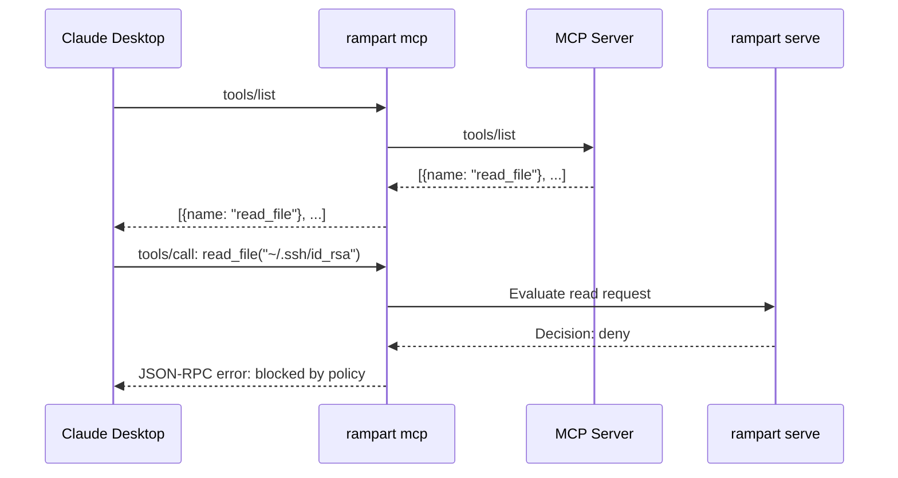

Rampart proxies Model Context Protocol (MCP) servers, evaluating every `tools/call` request against your policies before forwarding to the upstream server. Works with Claude Desktop, Cline, and any MCP client.

## Quick Setup

<Steps>
  <Step title="Start Rampart service">
    Launch the policy server:

    ```bash
    rampart serve install
    ```

    Runs on port 9090 with token at `~/.rampart/token`.
  </Step>

  <Step title="Update MCP client config">
    Point your MCP client to launch servers through Rampart's proxy:

    **Claude Desktop** (`~/Library/Application Support/Claude/claude_desktop_config.json`):
    ```json
    {
      "mcpServers": {
        "filesystem": {
          "command": "rampart",
          "args": ["mcp", "--", "npx", "@modelcontextprotocol/server-filesystem", "."]
        }
      }
    }
    ```

    **Cline** (VS Code settings):
    ```json
    {
      "cline.mcpServers": {
        "filesystem": {
          "command": "rampart",
          "args": ["mcp", "--", "npx", "@modelcontextprotocol/server-filesystem", "."]
        }
      }
    }
    ```
  </Step>

  <Step title="Restart MCP client">
    Restart Claude Desktop or reload VS Code for changes to take effect.
  </Step>
</Steps>

## How It Works



The proxy is transparent for `tools/list` but intercepts `tools/call` to check policies.

## What Gets Protected

All MCP tool invocations:

<CodeGroup>
```json Filesystem Server
{
  "method": "tools/call",
  "params": {
    "name": "read_file",
    "arguments": {
      "path": "/etc/passwd"
    }
  }
}
```

```json Database Server
{
  "method": "tools/call",
  "params": {
    "name": "execute_query",
    "arguments": {
      "query": "DROP TABLE users"
    }
  }
}
```

```json Exec Server
{
  "method": "tools/call",
  "params": {
    "name": "run_command",
    "arguments": {
      "command": "rm -rf /"
    }
  }
}
```
</CodeGroup>

Denied calls return a JSON-RPC error to the client. The upstream MCP server never sees them.

## Policy Configuration

Write policies for MCP tools:

```yaml ~/.rampart/policies/custom.yaml
version: "1"
default_action: allow

policies:
  - name: mcp-filesystem-deny-credentials
    match:
      tool: ["read", "read_file", "readFile"]
    rules:
      - action: deny
        when:
          path_matches:
            - "**/.ssh/*"
            - "**/.aws/credentials"
            - "**/.env"
        message: "MCP filesystem: credential access blocked"

  - name: mcp-database-block-destructive
    match:
      tool: ["execute_query", "executeQuery"]
    rules:
      - action: deny
        when:
          command_contains:
            - "DROP TABLE"
            - "DELETE FROM"
            - "TRUNCATE"
        message: "MCP database: destructive query blocked"

  - name: mcp-exec-ask-shell
    match:
      tool: ["exec", "run_command", "runCommand"]
    rules:
      - action: ask
        when:
          command_contains: ["curl", "wget", "nc"]
        message: "MCP exec: network command requires approval"
```

Reload:
```bash
rampart serve --reload
```

## Auto-Generate Policies

Scan an MCP server and generate a deny-by-default policy:

```bash
rampart mcp scan -- npx @modelcontextprotocol/server-filesystem .
```

Output:
```yaml
version: "1"
default_action: deny

policies:
  - name: mcp-server-allowlist
    rules:
      # Auto-generated from tools/list response
      - action: allow
        when:
          tool_matches:
            - "read_file"
            - "write_file"
            - "list_directory"
        message: "Allowed MCP tools"

      - action: deny
        when:
          tool_matches:
            - "delete_file"  # Flagged as destructive
        message: "Destructive tool blocked"
```

Save to policy file and customize as needed.

## Example Configurations

### Claude Desktop

Full config with multiple protected servers:

```json ~/Library/Application Support/Claude/claude_desktop_config.json
{
  "mcpServers": {
    "filesystem": {
      "command": "rampart",
      "args": ["mcp", "--", "npx", "@modelcontextprotocol/server-filesystem", "."]
    },
    "github": {
      "command": "rampart",
      "args": ["mcp", "--", "npx", "@modelcontextprotocol/server-github"],
      "env": {
        "GITHUB_TOKEN": "ghp_..."
      }
    },
    "database": {
      "command": "rampart",
      "args": ["mcp", "--mode", "monitor", "--", "python", "db_server.py"]
    }
  }
}
```

### Cline (VS Code)

```json .vscode/settings.json
{
  "cline.mcpServers": {
    "filesystem": {
      "command": "rampart",
      "args": ["mcp", "--", "npx", "@modelcontextprotocol/server-filesystem", "${workspaceFolder}"]
    }
  }
}
```

## Proxy Modes

<Tabs>
  <Tab title="Enforce (Default)">
    **Behavior:** Block denied tool calls

    ```json
    {
      "command": "rampart",
      "args": ["mcp", "--", "npx", "@modelcontextprotocol/server-filesystem", "."]
    }
    ```

    Denied calls return JSON-RPC error:
    ```json
    {
      "jsonrpc": "2.0",
      "id": 1,
      "error": {
        "code": -32000,
        "message": "Rampart: Credential access blocked"
      }
    }
    ```
  </Tab>

  <Tab title="Monitor">
    **Behavior:** Log all calls, never block

    ```json
    {
      "command": "rampart",
      "args": ["mcp", "--mode", "monitor", "--", "npx", "server"]
    }
    ```

    All tool calls pass through. Policy violations are logged to audit trail but not blocked.
  </Tab>

  <Tab title="Filter Tools">
    **Behavior:** Hide denied tools from tools/list

    ```json
    {
      "command": "rampart",
      "args": ["mcp", "--filter-tools", "--", "npx", "server"]
    }
    ```

    Denied tools are removed from the capabilities list. Client never sees them.
  </Tab>
</Tabs>

## Monitoring

### Live Dashboard

View MCP tool calls in real time:

```bash
open http://localhost:9090/dashboard/
```

### Audit Trail

MCP events are logged to the same audit file as hook events:

```bash
# Tail logs
rampart audit tail --follow

# Search for MCP calls
rampart audit search --tool read_file --decision deny

# Stats
rampart audit stats
```

Output:
```
Tool: read_file
  Total: 342
  Allowed: 310
  Denied: 8
  Logged: 24
```

## Example Session

Terminal output when running with MCP proxy:

```bash
$ rampart mcp -- npx @modelcontextprotocol/server-filesystem .

Rampart MCP Proxy started
Upstream: npx @modelcontextprotocol/server-filesystem .
Mode: enforce
Audit: ~/.rampart/audit/

[14:23:01] tools/list → 4 tools
[14:23:05] tools/call: read_file("./src/main.go") → allowed
[14:23:08] tools/call: read_file("~/.ssh/id_rsa") → denied (credential access blocked)
[14:23:12] tools/call: write_file("./output.txt") → allowed

Rampart: 3 calls evaluated, 1 denied, 0 logged
```

## Troubleshooting

### MCP client not connecting

1. **Check rampart is in PATH:**
   ```bash
   which rampart
   # Should output a path
   ```

2. **Test MCP server directly:**
   ```bash
   npx @modelcontextprotocol/server-filesystem .
   # Should start without errors
   ```

3. **Test with rampart:**
   ```bash
   rampart mcp -- npx @modelcontextprotocol/server-filesystem .
   # Should show "Rampart MCP Proxy started"
   ```

### Tools not being blocked

1. **Check mode:**
   ```bash
   # Make sure not using --mode monitor
   rampart mcp -- server  # Enforce mode (default)
   ```

2. **Test policy:**
   ```bash
   rampart test "read_file ~/.ssh/id_rsa"
   # Should show: Decision: deny
   ```

3. **Check audit logs:**
   ```bash
   rampart audit tail -n 10
   # Should show recent MCP calls
   ```

### Service connection errors

1. **Check service is running:**
   ```bash
   curl http://localhost:9090/healthz
   # Should return "ok"
   ```

2. **Check token:**
   ```bash
   cat ~/.rampart/token
   # Should output token
   ```

3. **Restart service:**
   ```bash
   rampart serve install  # Reinstall and restart
   ```

## Advanced: Approval Workflow

Use `ask` action for human-in-the-loop approval:

```yaml
policies:
  - name: mcp-ask-destructive
    match:
      tool: ["delete_file", "execute_query"]
    rules:
      - action: ask
        when:
          command_contains: ["DELETE", "DROP"]
        message: "Destructive operation requires approval"
```

When triggered:
1. MCP proxy blocks the call
2. Creates approval request in dashboard
3. User approves via:
   - Web dashboard: http://localhost:9090/dashboard/
   - CLI: `rampart approve <id>`
4. Proxy unblocks and forwards to server

Approvals expire after 1 hour by default (configurable with `--approval-timeout`).

## Multiple Servers

Protect multiple MCP servers with different policies:

```yaml ~/.rampart/policies/custom.yaml
policies:
  - name: filesystem-protect-credentials
    match:
      tool: ["read_file"]
    rules:
      - action: deny
        when:
          path_matches: ["**/.ssh/*", "**/.env"]
        message: "Filesystem: credential blocked"

  - name: github-rate-limit
    match:
      tool: ["create_issue", "create_pr"]
    rules:
      - action: watch
        message: "GitHub: creation logged"

  - name: database-block-drops
    match:
      tool: ["execute_query"]
    rules:
      - action: deny
        when:
          command_contains: ["DROP"]
        message: "Database: DROP blocked"
```

All servers share the same policy engine, but rules match based on tool names.
