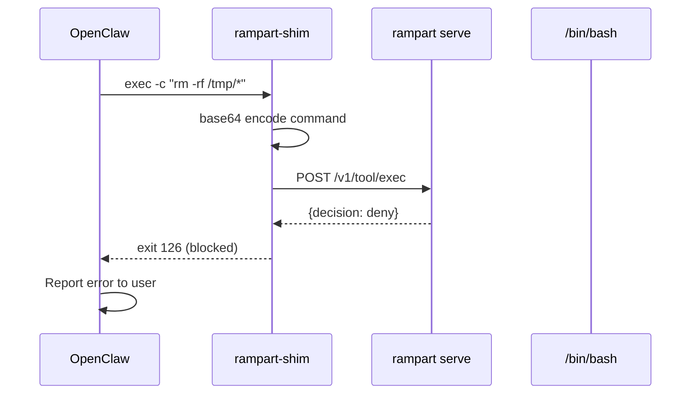

Rampart protects OpenClaw through a shell shim that intercepts exec tool calls. Optionally patch file tools (Read/Write/Edit/Grep) for comprehensive coverage.

## Quick Setup

<Steps>
  <Step title="Install shim and service">
    One command installs everything:

    ```bash
    rampart setup openclaw
    ```

    This creates:
    - Shell shim at `~/.local/bin/rampart-shim`
    - Systemd (Linux) or launchd (macOS) service running `rampart serve`
    - Default policy at `~/.rampart/policies/standard.yaml`

    <Note>
      Linux and macOS only. Windows is not supported for OpenClaw integration.
    </Note>
  </Step>

  <Step title="Configure OpenClaw gateway">
    Point OpenClaw to use the Rampart shim as its shell:

    ```bash
    export SHELL="$HOME/.local/bin/rampart-shim"
    ```

    Or update your OpenClaw gateway configuration file to set the shell path.
  </Step>

  <Step title="Restart OpenClaw gateway">
    Restart the OpenClaw gateway process for changes to take effect:

    ```bash
    # If running as systemd service
    systemctl --user restart openclaw-gateway

    # Or manually
    pkill -f openclaw
    openclaw gateway &
    ```
  </Step>

  <Step title="Optional: Patch file tools">
    For full coverage including file reads/writes:

    ```bash
    rampart setup openclaw --patch-tools
    ```

    <Warning>
      Modifies OpenClaw's node_modules. Re-run after OpenClaw upgrades.
    </Warning>
  </Step>
</Steps>

## How It Works

### Shell Shim Flow



OpenClaw calls the shim with `-c "command"`. The shim:
1. Encodes the command (base64 to preserve special characters)
2. POSTs to the policy server
3. Blocks if denied, executes if allowed

### File Tool Patching

With `--patch-tools`, Rampart injects policy checks into OpenClaw's TypeScript tools:

```javascript
// Original read.js
execute: async (_toolCallId, { path, offset, limit }, signal) => {
    const absolutePath = resolveReadPath(path, cwd);
    // ... read file
}

// Patched read.js
execute: async (_toolCallId, { path, offset, limit }, signal) => {
    /* RAMPART_READ_CHECK */ try {
        const __rr = await fetch("http://127.0.0.1:19090/v1/tool/read", {
            method: "POST",
            headers: { "Authorization": "Bearer " + process.env.RAMPART_TOKEN },
            body: JSON.stringify({ agent: "openclaw", params: { path } }),
            signal: AbortSignal.timeout(3000)
        });
        if (__rr.status === 403) {
            const __rd = await __rr.json().catch(() => ({}));
            return { content: [{ type: "text", text: "rampart: " + (__rd.message || "policy denied") }] };
        }
    } catch (__re) { /* fail-open */ }
    const absolutePath = resolveReadPath(path, cwd);
    // ... read file
}
```

Patched tools: Read, Write, Edit, Grep.

## Configuration

### Shell Shim

The shim script (`~/.local/bin/rampart-shim`) contains:

```bash
#!/usr/bin/env bash
REAL_SHELL="/bin/bash"
RAMPART_URL="http://127.0.0.1:19090"
RAMPART_TOKEN="rampart_abc123..."
RAMPART_MODE="enforce"

if [ "$1" = "-c" ]; then
    shift
    CMD="$1"
    shift

    # Encode and check with policy server
    ENCODED=$(printf '%s' "$CMD" | base64 | tr -d '\n\r')
    PAYLOAD=$(printf '{"agent":"openclaw","session":"main","params":{"command_b64":"%s"}}' "$ENCODED")
    RESP=$(curl -sS -X POST "${RAMPART_URL}/v1/tool/exec" \
        -H "Authorization: Bearer ${RAMPART_TOKEN}" \
        -H "Content-Type: application/json" \
        -d "$PAYLOAD" 2>/dev/null)

    # Check for deny decision
    if [ "$RAMPART_MODE" = "enforce" ] && echo "$RESP" | grep -q '"decision":"deny"'; then
        MSG=$(echo "$RESP" | sed -n 's/.*"message":"\([^"]*\)".*/\1/p')
        echo "rampart: blocked — ${MSG}" >&2
        exit 126
    fi

    exec "$REAL_SHELL" -c "$CMD" "$@"
fi

exec "$REAL_SHELL" "$@"
```

### Service Configuration

Systemd service at `~/.config/systemd/user/rampart-proxy.service`:

```ini
[Unit]
Description=Rampart Policy Proxy
Before=openclaw-gateway.service

[Service]
ExecStart=/usr/local/bin/rampart serve --port 19090 --config ~/.rampart/policies/standard.yaml
Restart=always
RestartSec=3
Environment=HOME=/home/user
Environment=RAMPART_TOKEN=rampart_abc123...

[Install]
WantedBy=default.target
```

Launchd (macOS) equivalent at `~/Library/LaunchAgents/com.rampart.proxy.plist`.

## Policy Examples

```yaml ~/.rampart/policies/custom.yaml
version: "1"
default_action: allow

policies:
  - name: openclaw-safe-dev
    match:
      agent: ["openclaw"]
      tool: ["exec"]
    rules:
      - action: allow
        when:
          command_matches:
            - "git *"
            - "npm *"
            - "docker ps"
        message: "Safe dev commands"

  - name: openclaw-block-destructive
    match:
      agent: ["openclaw"]
      tool: ["exec"]
    rules:
      - action: deny
        when:
          command_matches:
            - "rm -rf /*"
            - "dd if=*"
            - "mkfs.*"
        message: "Destructive commands blocked"

  - name: openclaw-protect-credentials
    match:
      agent: ["openclaw"]
      tool: ["read"]
    rules:
      - action: deny
        when:
          path_matches:
            - "**/.ssh/id_*"
            - "**/.aws/credentials"
            - "**/.env"
        message: "Credential access denied"

  - name: openclaw-approval-required
    match:
      agent: ["openclaw"]
    rules:
      - action: ask
        when:
          command_contains: ["kubectl apply", "terraform apply"]
        message: "Production deployment requires approval"
```

## Monitoring

### Terminal UI

Watch OpenClaw activity:

```bash
rampart watch --audit-dir ~/.rampart/audit
```

Output:
```
╔══════════════════════════════════════════════════════════════╗
║  RAMPART — enforce — openclaw                               ║
╠══════════════════════════════════════════════════════════════╣
║  ✅ 15:42:10  exec  "npm test"                 [allow-dev]   ║
║  🔴 15:42:15  exec  "rm -rf /var"              [block-dest]  ║
║  ✅ 15:42:18  read  ./src/config.js            [default]     ║
╚══════════════════════════════════════════════════════════════╝
```

### Audit Logs

```bash
# Tail logs
rampart audit tail --follow --audit-dir ~/.rampart/audit

# Search for denies
rampart audit search --decision deny --agent openclaw

# Stats
rampart audit stats --audit-dir ~/.rampart/audit
```

## Coverage Comparison

<Tabs>
  <Tab title="Shell Shim Only">
    **Covers:**
    - ✅ Bash exec tool (all shell commands)
    - ❌ Read tool (file reads)
    - ❌ Write tool (file writes)
    - ❌ Edit tool (file edits)
    - ❌ Grep tool (file searches)

    **Use when:**
    - You only care about shell command execution
    - You don't want to modify node_modules
    - You want zero maintenance (no re-patching after upgrades)
  </Tab>

  <Tab title="Shell Shim + Patched Tools">
    **Covers:**
    - ✅ Bash exec tool
    - ✅ Read tool
    - ✅ Write tool
    - ✅ Edit tool
    - ✅ Grep tool

    **Use when:**
    - You need comprehensive file operation control
    - You can re-patch after OpenClaw upgrades
    - You have write access to OpenClaw installation directory

    **Setup:**
    ```bash
    rampart setup openclaw --patch-tools
    ```

    **After upgrades:**
    ```bash
    npm install -g openclaw  # Update OpenClaw
    rampart setup openclaw --patch-tools --force  # Re-patch
    ```
  </Tab>
</Tabs>

## Troubleshooting

### Shim not intercepting commands

1. **Check OpenClaw is using the shim:**
   ```bash
   # In OpenClaw process
   echo $SHELL
   # Should output: /home/user/.local/bin/rampart-shim
   ```

2. **Verify shim is executable:**
   ```bash
   ls -la ~/.local/bin/rampart-shim
   # Should show -rwx------ (executable)
   ```

3. **Test shim directly:**
   ```bash
   ~/.local/bin/rampart-shim -c "echo test"
   # Should execute and print "test"
   ```

### Service not running

1. **Check service status:**
   ```bash
   # systemd
   systemctl --user status rampart-proxy

   # launchd
   launchctl list | grep rampart
   ```

2. **Check logs:**
   ```bash
   # systemd
   journalctl --user -u rampart-proxy -f

   # launchd
   tail -f ~/.rampart/rampart-proxy.log
   ```

3. **Restart service:**
   ```bash
   # systemd
   systemctl --user restart rampart-proxy

   # launchd
   launchctl unload ~/Library/LaunchAgents/com.rampart.proxy.plist
   launchctl load ~/Library/LaunchAgents/com.rampart.proxy.plist
   ```

### Patched tools not working

1. **Check if tools are patched:**
   ```bash
   grep -r "RAMPART_READ_CHECK" /usr/lib/node_modules/openclaw/
   # Should find matches in read.js, write.js, edit.js, grep.js
   ```

2. **Verify backup files exist:**
   ```bash
   ls -la /usr/lib/node_modules/openclaw/.../tools/*.rampart-backup
   # Should show backup files for each patched tool
   ```

3. **Re-patch with force:**
   ```bash
   rampart setup openclaw --patch-tools --force
   ```

### Permission denied during patching

File tools require write access to OpenClaw's node_modules:

```bash
# Global install (needs sudo)
sudo rampart setup openclaw --patch-tools

# Or use local install
npm install openclaw  # Install to ./node_modules
export PATH="$PWD/node_modules/.bin:$PATH"
rampart setup openclaw --patch-tools  # Patch local install
```

## Uninstalling

Remove OpenClaw integration:

```bash
rampart setup openclaw --remove
```

This removes:
- Shell shim at `~/.local/bin/rampart-shim`
- Systemd/launchd service
- Tool patches (restores from `.rampart-backup` files)

Preserves:
- Policy files at `~/.rampart/policies/`
- Audit logs at `~/.rampart/audit/`

Complete removal:
```bash
rampart serve uninstall
rm -rf ~/.rampart
```

## Advanced: Human-in-the-Loop Approval

OpenClaw supports chat-based approval for `ask` actions:

```yaml
policies:
  - name: openclaw-ask-deploy
    match:
      agent: ["openclaw"]
    rules:
      - action: ask
        when:
          command_contains: ["kubectl apply"]
        message: "Approve this deployment?"
```

When triggered:
1. OpenClaw blocks the command
2. Sends message to chat: "Approve this deployment? (ID: abc123)"
3. User responds: "approve abc123" or "deny abc123"
4. Rampart resolves the approval and unblocks

Approve via API:
```bash
rampart approve abc123
```

Or via dashboard: http://localhost:19090/dashboard/
