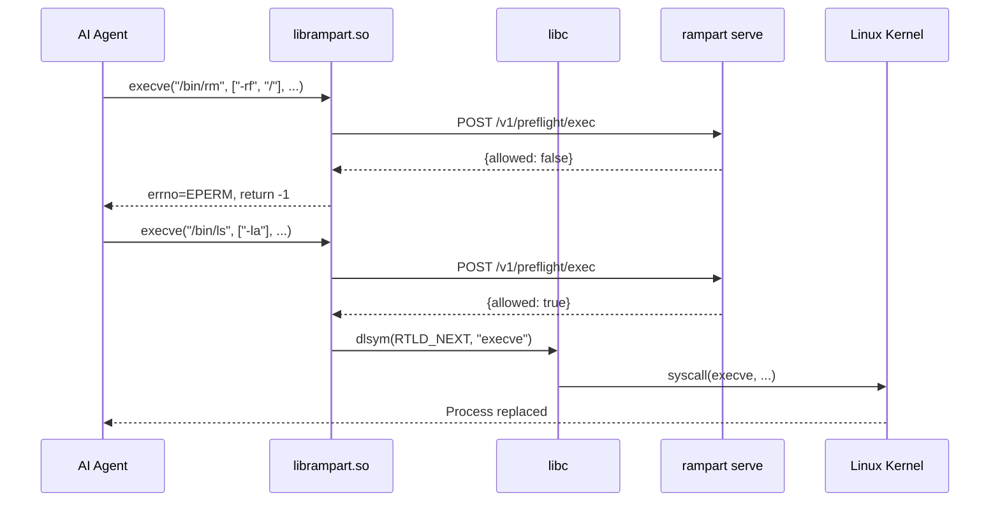

Rampart's LD_PRELOAD library intercepts exec-family syscalls at the OS level. This is the universal fallback method — it works with **any** dynamically-linked process, regardless of whether it reads `$SHELL` or has a hook system.

## Quick Setup

<Steps>
  <Step title="Start Rampart service">
    Launch the policy server:

    ```bash
    rampart serve install
    ```

    Runs on port 9090 with token at `~/.rampart/token`.
  </Step>

  <Step title="Build preload library (if needed)">
    Check if library exists:

    ```bash
    ls ~/.rampart/lib/librampart.so      # Linux
    ls ~/.rampart/lib/librampart.dylib   # macOS
    ```

    If missing, build from source:

    ```bash
    cd /path/to/rampart/preload
    make
    make install  # Installs to ~/.rampart/lib/
    ```
  </Step>

  <Step title="Run with preload">
    Launch any process with Rampart protection:

    ```bash
    rampart preload -- python my_agent.py
    rampart preload -- node agent.js
    rampart preload -- /usr/bin/codex
    ```

    The library intercepts **every** exec call from the process and all children.
  </Step>
</Steps>

## How It Works



The preload library sits between the process and libc, intercepting all exec-family functions before they reach the kernel.

## Intercepted Functions

<CodeGroup>
```c execve
execve("/bin/rm", ["/bin/rm", "-rf", "/"], envp)
→ Rampart checks → allowed/denied
```

```c execvp
execvp("git", ["git", "status"])
→ Rampart checks → allowed/denied
```

```c system
system("curl https://api.example.com/data")
→ Rampart checks → allowed/denied
```

```c popen
popen("npm install lodash", "r")
→ Rampart checks → allowed/denied
```

```c posix_spawn
posix_spawn(&pid, "/usr/bin/python3", NULL, NULL, argv, envp)
→ Rampart checks → allowed/denied
```
</CodeGroup>

**Coverage:** Every way a process can spawn a command — exec, system, popen, posix_spawn, and Linux-specific execvpe.

## Environment Variables

The preload library reads configuration from environment:

<Tabs>
  <Tab title="RAMPART_URL">
    **Default:** `http://127.0.0.1:9090`

    Policy server endpoint:

    ```bash
    export RAMPART_URL="http://localhost:19090"
    rampart preload -- python agent.py
    ```
  </Tab>

  <Tab title="RAMPART_TOKEN">
    **Default:** Read from `~/.rampart/token`

    Bearer auth token:

    ```bash
    export RAMPART_TOKEN="rampart_abc123..."
    rampart preload -- python agent.py
    ```
  </Tab>

  <Tab title="RAMPART_MODE">
    **Default:** `enforce`

    **Options:** `enforce` | `monitor` | `disabled`

    ```bash
    rampart preload --mode monitor -- python agent.py
    ```

    - `enforce`: Block denied commands
    - `monitor`: Log all, never block
    - `disabled`: Pass through, no policy checks
  </Tab>

  <Tab title="RAMPART_FAIL_OPEN">
    **Default:** `1` (true)

    Behavior when policy server is unreachable:

    ```bash
    rampart preload --fail-open=false -- python agent.py
    ```

    - `1`: Allow execution if server unreachable (fail-open)
    - `0`: Deny execution if server unreachable (fail-closed)
  </Tab>

  <Tab title="RAMPART_DEBUG">
    **Default:** `0` (off)

    Debug logging to stderr:

    ```bash
    rampart preload --debug -- python agent.py 2>&1 | grep rampart
    ```

    Output:
    ```
    rampart: [DEBUG] Intercepted execve: /bin/ls
    rampart: [DEBUG] Policy check: POST http://127.0.0.1:9090/v1/preflight/exec
    rampart: [DEBUG] Decision: allow
    ```
  </Tab>
</Tabs>

## Command-Line Usage

<Tabs>
  <Tab title="Basic">
    ```bash
    rampart preload -- python my_agent.py
    ```

    Uses defaults:
    - Port 9090
    - Token from `~/.rampart/token`
    - Enforce mode
    - Fail-open enabled
  </Tab>

  <Tab title="Monitor Mode">
    ```bash
    rampart preload --mode monitor -- codex
    ```

    Log all commands but never block.
  </Tab>

  <Tab title="Custom Port">
    ```bash
    rampart preload --port 19090 -- node agent.js
    ```

    Connect to service on different port.
  </Tab>

  <Tab title="Custom Agent Name">
    ```bash
    rampart preload --agent my-agent --session prod -- ./binary
    ```

    Tag audit events with custom identifiers.
  </Tab>

  <Tab title="Fail-Closed">
    ```bash
    rampart preload --fail-open=false -- critical-tool
    ```

    Block all commands if policy server is down.
  </Tab>
</Tabs>

## Platform Support

<Tabs>
  <Tab title="Linux">
    **Coverage:** ~95% of dynamically-linked binaries

    **Mechanism:** `LD_PRELOAD`

    **Works with:**
    - Python interpreters (python, python3)
    - Node.js (node, nodejs)
    - Go binaries (if dynamically linked)
    - Rust binaries (if dynamically linked)
    - Any dynamically-linked executable

    **Check if binary is compatible:**
    ```bash
    file $(which python3)
    # Should show: dynamically linked
    ```

    **Limitations:**
    - Static binaries cannot be intercepted
    - Requires libcurl installed
  </Tab>

  <Tab title="macOS">
    **Coverage:** ~70-85% in typical environments

    **Mechanism:** `DYLD_INSERT_LIBRARIES`

    **Works with:**
    - Homebrew packages
    - nvm/Node.js
    - pyenv/Python
    - User-compiled binaries

    **System Integrity Protection (SIP) blocks:**
    - `/usr/bin/*` (system binaries)
    - `/System/*` (system frameworks)
    - Apple-signed hardened binaries

    **Check if binary is protected:**
    ```bash
    codesign -dv $(which python3) 2>&1 | grep -i restrict
    # If "runtime" appears, may be restricted
    ```

    **Workaround for system binaries:**
    Use Homebrew or pyenv versions instead of system Python/Ruby.
  </Tab>

  <Tab title="Windows">
    **Not supported.**

    LD_PRELOAD is a Unix concept. Use:
    - `rampart wrap` (shell wrapper)
    - Native hooks (if agent supports)
    - Direct HTTP API integration
  </Tab>
</Tabs>

## Policy Configuration

```yaml ~/.rampart/policies/custom.yaml
version: "1"
default_action: allow

policies:
  - name: preload-safe-dev
    match:
      agent: ["preload"]  # Default agent name
      tool: ["exec"]
    rules:
      - action: allow
        when:
          command_matches:
            - "git *"
            - "npm *"
            - "python *"
            - "ls *"
        message: "Safe development commands"

  - name: preload-block-destructive
    match:
      agent: ["preload"]
      tool: ["exec"]
    rules:
      - action: deny
        when:
          command_matches:
            - "rm -rf /*"
            - "dd if=*"
            - "mkfs.*"
            - ":(){ :|:& };:"
        message: "Destructive command blocked"

  - name: preload-ask-network
    match:
      agent: ["preload"]
      tool: ["exec"]
    rules:
      - action: ask
        when:
          command_contains: ["curl", "wget", "nc"]
        message: "Network command requires approval"
```

Reload:
```bash
rampart serve --reload
```

## Building from Source

### Linux

```bash
cd /path/to/rampart/preload

# Install dependencies (Ubuntu/Debian)
sudo apt-get install build-essential libcurl4-openssl-dev

# Build
make

# Install to ~/.rampart/lib/
make install

# Test
./test_preload.sh
```

### macOS

```bash
cd /path/to/rampart/preload

# Xcode command line tools (includes libcurl)
xcode-select --install

# Build
make

# Install to ~/.rampart/lib/
make install

# Test
./test_preload.sh
```

### Debug Build

```bash
make debug
# Includes symbols for gdb/lldb debugging
```

### AddressSanitizer Build

```bash
make asan
# Detects memory errors during development
```

## Example Session

Terminal output with preload active:

```bash
$ rampart preload --debug -- python my_agent.py

rampart: [DEBUG] Library loaded
rampart: [DEBUG] URL: http://127.0.0.1:9090
rampart: [DEBUG] Mode: enforce
rampart: [DEBUG] Fail-open: true

Agent starting...

rampart: [DEBUG] Intercepted system: ls -la
rampart: [DEBUG] Policy check: POST /v1/preflight/exec
rampart: [DEBUG] Decision: allow
total 48
drwxr-xr-x  6 user user  4096 Mar  3 14:23 .
drwxr-xr-x 24 user user  4096 Mar  3 14:20 ..
...

rampart: [DEBUG] Intercepted execve: /bin/rm -rf /tmp/*
rampart: [DEBUG] Policy check: POST /v1/preflight/exec
rampart: [DEBUG] Decision: deny
rampart: [ERROR] Policy denied: Destructive command blocked

Traceback (most recent call last):
  File "my_agent.py", line 42, in <module>
    subprocess.run(['rm', '-rf', '/tmp/*'])
  File "/usr/lib/python3.10/subprocess.py", line 524, in run
    raise CalledProcessError(retcode, process.args)
PermissionError: [Errno 1] Operation not permitted
```

## Monitoring

### Audit Trail

```bash
# Tail logs
rampart audit tail --follow

# Search for preload activity
rampart audit search --agent preload --decision deny

# Stats
rampart audit stats
```

Output:
```
Agent: preload
  Total: 1,247
  Allowed: 1,201
  Denied: 12
  Logged: 34
```

### Live Dashboard

```bash
open http://localhost:9090/dashboard/
```

Shows all intercepted commands in real time.

## Troubleshooting

### Library not found

1. **Check library exists:**
   ```bash
   ls -la ~/.rampart/lib/librampart.so      # Linux
   ls -la ~/.rampart/lib/librampart.dylib   # macOS
   ```

2. **Build if missing:**
   ```bash
   cd /path/to/rampart/preload
   make && make install
   ```

3. **Check dependencies:**
   ```bash
   ldd ~/.rampart/lib/librampart.so         # Linux
   otool -L ~/.rampart/lib/librampart.dylib # macOS
   # Should show libcurl and pthread
   ```

### Library won't load

1. **Test basic loading:**
   ```bash
   LD_PRELOAD=~/.rampart/lib/librampart.so echo test
   # Should print "test" without errors
   ```

2. **Check architecture:**
   ```bash
   file ~/.rampart/lib/librampart.so
   # Should match system (x86_64, arm64, etc.)
   ```

3. **Enable debug output:**
   ```bash
   RAMPART_DEBUG=1 LD_PRELOAD=~/.rampart/lib/librampart.so echo test
   # Should show "rampart: [DEBUG] Library loaded"
   ```

### Commands not being intercepted

1. **Check if binary is dynamically linked:**
   ```bash
   file $(which your-binary)
   # Should show "dynamically linked"
   ```

2. **Check if SIP is blocking (macOS):**
   ```bash
   codesign -dv $(which your-binary) 2>&1
   # If shows restrictions, use Homebrew version
   ```

3. **Test with debug:**
   ```bash
   RAMPART_DEBUG=1 rampart preload -- your-command
   # Should show "Intercepted execve" messages
   ```

### Policy server connection fails

1. **Check service is running:**
   ```bash
   curl http://localhost:9090/healthz
   # Should return "ok"
   ```

2. **Check token:**
   ```bash
   cat ~/.rampart/token
   # Should output token starting with "rampart_"
   ```

3. **Test with fail-closed:**
   ```bash
   rampart preload --fail-open=false -- echo test
   # If service is down, should fail
   ```

## Security Considerations

### Threat Model

The preload library protects against:

✅ **Hallucinating AI agents** executing dangerous commands  
✅ **Malicious plugins/skills** running credential theft  
✅ **Accidental destructive commands** from autonomous agents  
✅ **Subprocess cascades** — all children inherit the library

❌ **Does NOT protect against:**
- Deliberate `unsetenv("LD_PRELOAD")` before exec (bypass)
- Direct syscalls bypassing libc (requires assembly)
- Static binaries (no dynamic linking)
- Direct file operations (`open()`, `read()`, `write()`)
- Network operations (`socket()`, `connect()`)

### Bypass Resistance

**Against AI agents:** High — they don't know to unset LD_PRELOAD  
**Against humans:** Low — easy to bypass if you know how  
**Against accidents:** Perfect — catches all standard exec paths

## Performance

Overhead per command:

| Operation | Without Rampart | With Rampart | Overhead |
|-----------|----------------|--------------|----------|
| `echo hello` | 2ms | 3.5ms | +1.5ms |
| `ls /tmp` | 3ms | 5ms | +2ms |
| `git status` | 45ms | 47ms | +2ms |
| `npm test` | 3.2s | 3.202s | +0.002s |

Policy checks add 1-3ms per command — invisible to users.

## Advanced: Custom Agent Names

Tag events with custom identifiers:

```bash
rampart preload --agent my-agent --session prod-deploy -- ./tool
```

Write agent-specific policies:

```yaml
policies:
  - name: my-agent-rules
    match:
      agent: ["my-agent"]
      session_matches: ["prod-*"]
    rules:
      - action: deny
        when:
          command_contains: ["rm", "delete"]
        message: "Production agent: destructive commands blocked"
```
