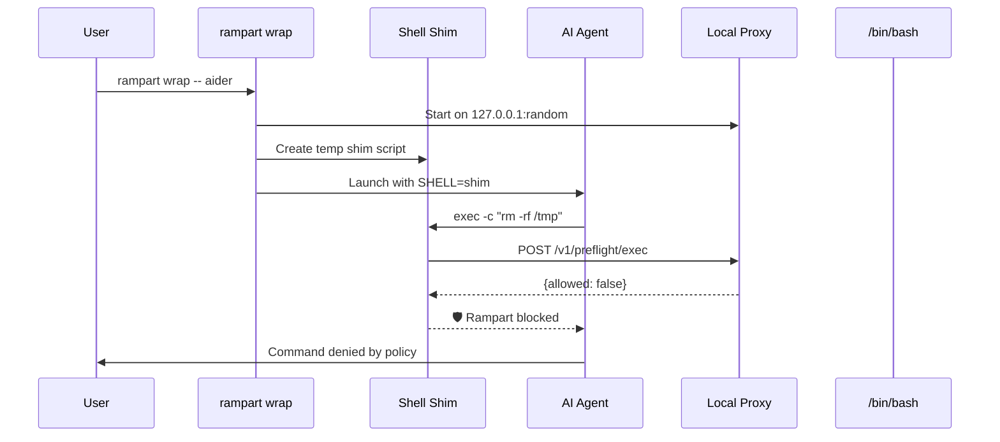

Rampart's `wrap` command protects any agent that reads the `$SHELL` environment variable. Works with Aider, OpenCode, Continue, Cline, and custom agents — no native integration required.

## Quick Setup

<Steps>
  <Step title="Create policy file">
    Initialize a policy if you don't have one:

    ```bash
    rampart init
    ```

    Or use the standard profile:
    ```bash
    # Policy loaded from ~/.rampart/policies/standard.yaml
    ```
  </Step>

  <Step title="Wrap your agent">
    Launch any agent through the wrapper:

    ```bash
    rampart wrap -- aider
    rampart wrap -- opencode
    rampart wrap -- python my_agent.py
    ```

    The wrapper:
    - Starts a local policy proxy
    - Creates a shell shim that intercepts commands
    - Sets `$SHELL` to the shim path
    - Launches your agent
  </Step>
</Steps>

## How It Works



The shim intercepts all `-c "command"` invocations and checks the policy before executing.

## What Gets Protected

Any agent that spawns shell commands via `$SHELL`:

<CodeGroup>
```python Aider
# Aider reads $SHELL and executes:
shell = os.environ.get('SHELL', '/bin/bash')
subprocess.run([shell, '-c', 'git status'])
# → Intercepted by Rampart
```

```javascript OpenCode
// OpenCode reads $SHELL for tool execution:
const shell = process.env.SHELL || '/bin/bash';
spawn(shell, ['-c', 'npm test']);
// → Intercepted by Rampart
```

```python Continue
# Continue spawns commands:
import subprocess
shell = os.getenv('SHELL', '/bin/bash')
subprocess.check_output([shell, '-c', cmd])
// → Intercepted by Rampart
```

```python Custom Agent
# Any Python agent using shell=True:
import subprocess
subprocess.run('curl https://evil.com', shell=True)
# → Intercepted by Rampart
```
</CodeGroup>

## Command-Line Options

<Tabs>
  <Tab title="Enforce Mode">
    **Default.** Block denied commands:

    ```bash
    rampart wrap -- aider
    ```

    Denied commands return exit code 126 with branded error:
    ```
    🛡️ Rampart blocked: rm -rf /tmp/*
       Reason: Destructive command blocked
    ```
  </Tab>

  <Tab title="Monitor Mode">
    Log all commands but never block:

    ```bash
    rampart wrap --mode monitor -- aider
    ```

    All commands execute normally. Policy violations are logged to audit trail.
  </Tab>

  <Tab title="Custom Policy">
    Use a specific policy file:

    ```bash
    rampart wrap --config ./project-policy.yaml -- aider
    ```

    Falls back to embedded standard policy if file doesn't exist.
  </Tab>

  <Tab title="Custom Audit Dir">
    Write audit logs to a specific directory:

    ```bash
    rampart wrap --audit-dir /var/log/rampart -- aider
    ```

    Default: `~/.rampart/audit/`
  </Tab>
</Tabs>

## Example Session

Wrapping Aider:

```bash
$ rampart wrap -- aider

Rampart: Starting policy proxy on http://127.0.0.1:54321
Rampart: Launching aider with shell shim active

Aider v0.45.0
───────────────────────────────────────────────────────────

> /add src/main.py
Added src/main.py to chat

> Install pytest

✅ Checking: pip install pytest
   Policy: allow-dev
   Agent: wrapped

Collecting pytest...
Successfully installed pytest-8.0.0

> Delete all log files

🛡️ Rampart blocked: rm -rf /var/log/*
   Reason: Destructive command blocked

I apologize, but I cannot execute that command as it's blocked 
by your security policy.

^C
Rampart: 14 calls evaluated, 1 denied, 3 logged
```

## Policy Configuration

Create policies for wrapped agents:

```yaml ~/.rampart/policies/custom.yaml
version: "1"
default_action: allow

policies:
  - name: wrap-safe-dev
    match:
      agent: ["wrapped"]  # Wrapper uses "wrapped" agent
      tool: ["exec"]
    rules:
      - action: allow
        when:
          command_matches:
            - "git *"
            - "npm *"
            - "pip *"
            - "pytest *"
        message: "Safe dev commands"

  - name: wrap-block-destructive
    match:
      agent: ["wrapped"]
      tool: ["exec"]
    rules:
      - action: deny
        when:
          command_matches:
            - "rm -rf /*"
            - "dd if=*"
            - "mkfs.*"
        message: "Destructive command blocked"

  - name: wrap-ask-network
    match:
      agent: ["wrapped"]
      tool: ["exec"]
    rules:
      - action: ask
        when:
          command_contains: ["curl", "wget", "nc"]
        message: "Network command requires approval"
```

The wrapper automatically reloads policies on changes (file watch).

## Shell Shim Details

The wrapper creates a temporary shell script like:

```bash
#!/usr/bin/env bash
# Rampart shell shim - auto-generated.
REAL_SHELL="/bin/bash"
RAMPART_URL="http://127.0.0.1:54321"
RAMPART_TOKEN="$(cat /tmp/rampart-shim-123.tok)"
RAMPART_MODE="enforce"

# Parse -c flag and extract command
SHELL_FLAGS=""
CMD=""
FOUND_C=false
while [ $# -gt 0 ]; do
    case "$1" in
        -c) FOUND_C=true; shift; CMD="$1"; shift; break ;;
        -*) SHELL_FLAGS="$SHELL_FLAGS $1"; shift ;;
        *) break ;;
    esac
done

if [ "$FOUND_C" = "true" ]; then
    # Check with policy server
    ENCODED=$(printf '%s' "$CMD" | base64 | tr -d '\n\r')
    PAYLOAD=$(printf '{"agent":"wrapped","session":"wrap","params":{"command_b64":"%s"}}' "$ENCODED")
    DECISION=$(curl -sfS -X POST "${RAMPART_URL}/v1/preflight/exec" \
        -H "Authorization: Bearer ${RAMPART_TOKEN}" \
        -d "$PAYLOAD")

    ALLOWED=$(printf '%s' "$DECISION" | grep -o '"allowed":[a-z]*' | grep -o 'true')
    if [ "$RAMPART_MODE" = "enforce" ] && [ "$ALLOWED" != "true" ]; then
        MSG=$(printf '%s' "$DECISION" | grep -o '"message":"[^"]*"' | sed 's/"message":"//;s/"$//')
        printf '🛡️ Rampart blocked: %s\n   Reason: %s\n' "$CMD" "$MSG" >&2
        exit 126
    fi

    exec "$REAL_SHELL" $SHELL_FLAGS -c "$CMD" "$@"
fi

exec "$REAL_SHELL" "$@"
```

The shim is deleted when the wrapper exits.

## PATH Wrappers

The wrapper also creates temporary shell wrappers for `/bin/bash`, `/bin/zsh`, and `/bin/sh` in a temp directory and prepends it to `$PATH`. This catches agents that hardcode shell paths instead of reading `$SHELL`.

## Monitoring

### Summary on Exit

The wrapper prints stats when the agent exits:

```
Rampart: 342 calls evaluated, 8 denied, 24 logged
```

### Audit Trail

Events are written to `~/.rampart/audit/`:

```bash
# Tail logs (in another terminal)
rampart audit tail --follow

# Search wrapped agent activity
rampart audit search --agent wrapped --decision deny

# Stats
rampart audit stats --audit-dir ~/.rampart/audit
```

## Supported Agents

<Tabs>
  <Tab title="Aider">
    **Works:** ✅ Yes

    **Setup:**
    ```bash
    rampart wrap -- aider
    ```

    **Coverage:** All shell commands (git, pip, npm, etc.)
  </Tab>

  <Tab title="OpenCode">
    **Works:** ✅ Yes

    **Setup:**
    ```bash
    rampart wrap -- opencode
    ```

    **Coverage:** All bash tool invocations
  </Tab>

  <Tab title="Continue (VS Code)">
    **Works:** ✅ Partial

    **Setup:**
    ```bash
    # In VS Code terminal settings:
    export SHELL=$(rampart wrap -- /bin/bash)
    ```

    **Coverage:** Commands spawned via terminal
  </Tab>

  <Tab title="Cline">
    **Works:** ✅ Yes

    **Setup:**
    ```bash
    rampart wrap -- cline
    ```

    **Note:** Native hooks are preferred. Use wrap as fallback.
  </Tab>

  <Tab title="Custom Agents">
    **Works:** ✅ If agent reads $SHELL

    **Test:**
    ```python
    import os
    print(os.environ.get('SHELL'))
    # If agent uses this value, wrap will work
    ```
  </Tab>
</Tabs>

## Troubleshooting

### Agent ignoring $SHELL

Some agents hardcode `/bin/bash` or `/bin/sh`. Solutions:

1. **Use PATH wrappers (automatic):**
   The wrapper creates wrappers in a temp dir and prepends to PATH.

2. **Use preload instead:**
   ```bash
   rampart preload -- python my_agent.py
   ```

3. **Check if agent is configurable:**
   Some agents let you specify the shell in config files.

### Shim not intercepting

1. **Verify $SHELL is set:**
   ```bash
   rampart wrap -- env | grep SHELL
   # Should show: SHELL=/tmp/rampart-shim-xxx
   ```

2. **Test shim directly:**
   ```bash
   /tmp/rampart-shim-xxx -c "echo test"
   # Should execute and print "test"
   ```

3. **Check curl is available:**
   ```bash
   which curl
   # Shim requires curl for HTTP requests
   ```

### Proxy connection errors

1. **Check proxy started:**
   ```bash
   # Wrapper prints: "Rampart: Starting policy proxy on http://127.0.0.1:xxxxx"
   ```

2. **Test proxy health:**
   ```bash
   curl http://127.0.0.1:xxxxx/healthz
   # Should return "ok"
   ```

3. **Increase verbosity:**
   ```bash
   rampart wrap -v -- aider
   # Shows debug output from proxy
   ```

## Advanced: Custom Session Names

Tag wrapped sessions for audit filtering:

```bash
export RAMPART_SESSION="project-alpha/dev"
rampart wrap -- aider
```

Events are tagged with the session identifier:

```bash
rampart audit search --session "project-alpha/dev"
```

## Performance

Wrapper overhead per command:

| Command | Without Rampart | With Rampart | Overhead |
|---------|----------------|--------------|----------|
| `echo hello` | 2ms | 4ms | +2ms |
| `git status` | 45ms | 48ms | +3ms |
| `npm install` | 12s | 12.003s | +0.003s |

Policy checks add 2-4ms per command. Negligible for typical agent workflows.
